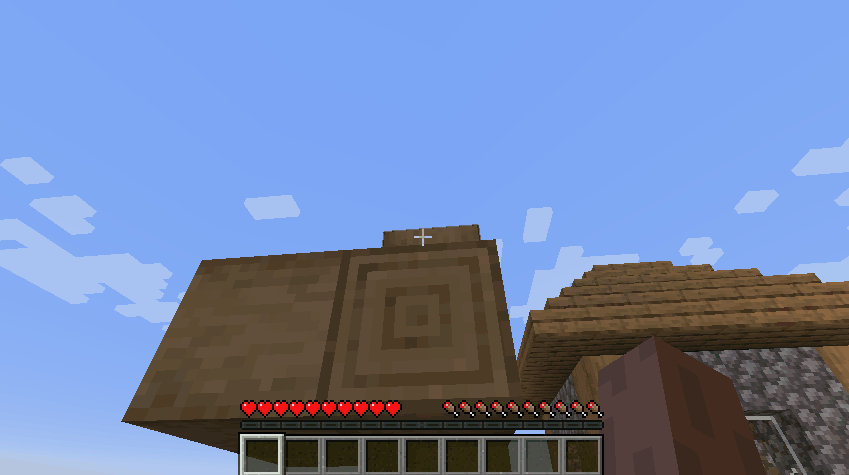
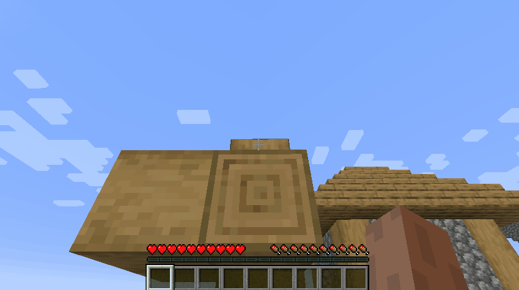
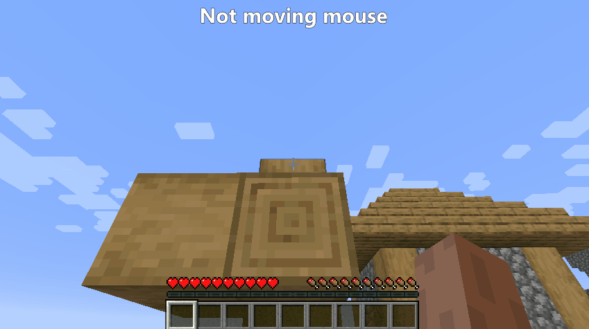
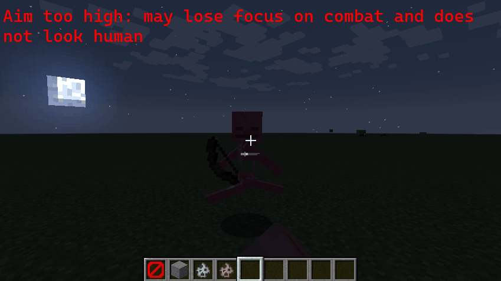
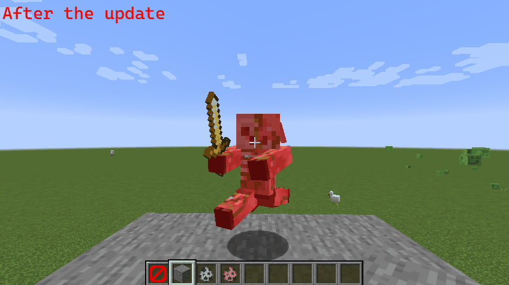

## Version 1.2.0

*Built for forge 1.16.3, works with 1.16.2 and 1.16.1*

- Smart block aim assistance

**BEFORE:**

**AFTER:**

It will recognize the block that you're trying to break.

But, if you want to change the block that you're breaking, just move your mouse.

- Improved attack assistance (it puts your crosshair higher than before)
- Increased attack assistance duration (1 sec -> 1.7 sec)
- The assistance won't be running while you're in GUIs

## Version 1.1.0

- Built for forge 1.16.2
- Split aimForce into:
    - aimForceBlocks: the force of the aim assistance on blocks
    - aimForceMobs: the force of the aim assistance on mobs
- Changed default force values:
    - 4.0 for mobs
    - 2.5 for blocks
- When you're fighting a mob, the mod understands it and won't help you mining while you're fighting. Same thing if you're mining. It will help you to mine and not to fight.
- Mining assistance now turns off as soon as the player stops mining
- Added a version checker
- Fixed an issue where the assistance would shake

## Version 1.0.1

**Core:**
- Improved aim assistance on mobs

## Version 1.0.0

**Core:**
- Aim assistance for mobs (while fighting)
- Aim assistance for blocks (while mining)

**Settings:**
- Aim force customizable (0.1 -> 10.0)
- Assistance on mobs (on/off)
- Assistance on blocks (on/off)
