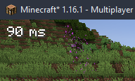

# Aim Assistance

A minecraft mod that helps aiming (at mods, blocks, but not players). Made for newbies or disabled players with difficulties to aim in general.

## Disclamer

**The mod has been designed to simplify the gameplay of people with disabilities**.

If you play online, make sure that the server allows the use of this mod. It won't work on
other players anyway, so it won't give you a PvP advantage. Also, the server owner can easily
blacklist this mod by blacklisting its id ("aimassistancemod"). I am not responsible for any
misuse of this mod.

## Roadmap
Check [github projects](https://github.com/N3ROO/AimAssistanceMod/projects)

## Contributing
Don't hesitate to contribute. Even if it's your first time, it's never too late to learn!

If you want to contribute, make sure to:
- Try to follow the [Google Java Style Guide](https://google.github.io/styleguide/javaguide.html), but the column limit is 120 and not 100.
- Make sure that your commits are clear enough to understand what changed
I will most likely accept your pull request even if it's just a typo fix! :)

## Credits & Acknowledgements

- [@N3ROO](https://github.com/N3ROO)  - *Main developer*
